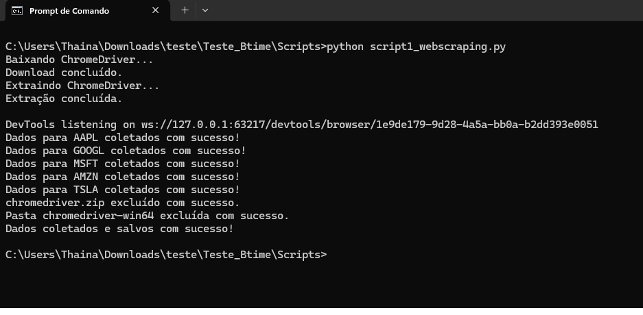
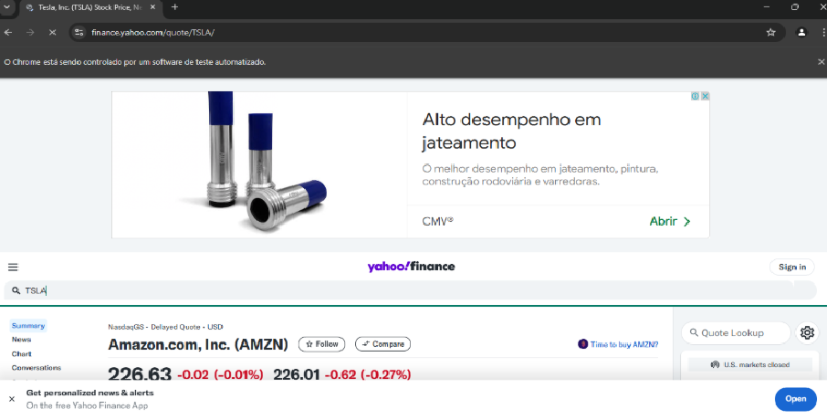
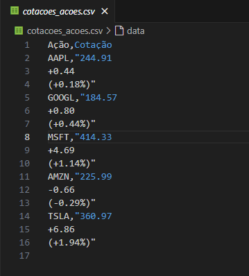
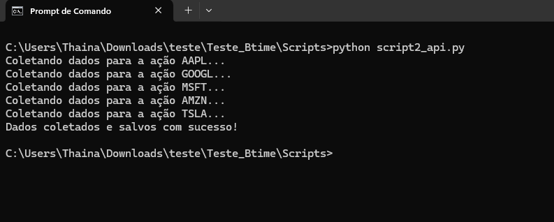
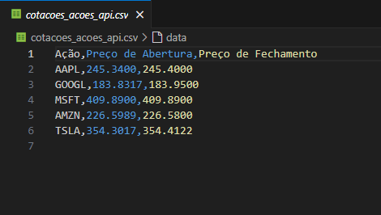

# Teste Btime - Vaga Desenvolvedor RPA Pleno


## Índice
- <a name="#descricao">Descrição do Projeto</a>
- <a href="#funcinalidades">Funcionalidades do Projeto</a>
- <a href="#demonstracao">Demonstração da Aplicação</a>
- <a href="#acesso">Acesso ao Projeto</a>
- <a href="#tecnologias">Tecnologias Utilizadas</a>
- <a href="#autoreas">Pessoas Autoras</a>

## 📄 Descrição do Projeto
Criação de dois scripts em Python que automatizem a coleta de dados do website Yahoo Finance. O primeiro script deve utilizar técnicas de web scraping, o segundo deve realizar a coleta de dados por meio de uma API pública relacionada ao mesmo tema. Em ambos os casos, os dados extraídos devem ser formatados e salvos em um arquivo CSV.

### Script 1: Web Scraping
Utilizar Python e bibliotecas como Selenium, BeautifulSoup, ou Scrapy para realizar o web scraping.
O script deve ser capaz de lidar com bloqueios e outras restrições comuns do web scraping.

### Script 2: API
Utilizar Python para acessar uma API pública que forneça dados semelhantes aos obtidos no web scraping.
Implementar a requisição à API e formatar os dados recebidos de maneira semelhante ao script de web scraping. 

## ✔️ Funcionalidades do Projeto
### Script 1: Web Scraping
- [x] Baixar o arquivo Chromedriver em ZIP
- [x] Extrair arquivos da pasta ZIP
- [x] Bloqueios de scraping para evitar bloqueios na aplicação
- [x] Gerando user-agents aleatórios para não detectar a automação
- [x] Instanciando o Chromedriver
- [x] Instanciando ações : AAPL, GOOGL, MSFT, AMZN e TSLA
- [x] Abrindo site do Yahoo Finance
- [x] Pesquisando cotações 
- [x] Coletando informações das cotações
- [x] Fechando navegador
- [x] Salvando dados em um arquivo CSV
- [x] Apagando arquivos ZIP e pasta do Chromedriver do diretório

### Scritp 2: API
- [x] Definição de chave API da Alpha Vantage
- [x] Instanciando URL da Alpha Vantage
- [x] Requisição para a API Alpha Vantage
- [x] Enviando os parâmetros para a API Alpha Vantage
- [x] Função para extrair cotações mais recentes
- [x] Instanciando ações AAPL, GOOGL, MSFT, AMZN e TSLA
- [x] Coletando as cotações das ações
- [x] Salvando os dados em um arquivo CSV

## 💻 Demonstração da Aplicação
### Script 1: Web Scraping

Console com as etapas do script 


Site do Yahoo Finance pesquisando uma ação


Arquivo CSV retornando as cotações das ações

### Script 2: API

Console com as etapas do script 


Arquivo CSV retornando as cotações das ações

## 🔓 Acesso ao Projeto
### Requisitos:
- Python 3.x (caso não tenha, baixe a versão mais recente em: https://www.python.org/)
- Google Chrome (versão mais recente 133.0.6943.126)

```bash
# Clone este repositório
$ git clone https://github.com/ThainaSilva100/Teste_Btime.git

# Acesse a pasta do projeto no seu terminal
$ cd Teste_Btime

# Instale as dependências
$ pip install selenium
$ pip install fake_useragent
$ pip install requests
```

### Obter uma Chave da API Alpha Vantage:

- Para usar a API da Alpha Vantage, você precisa de uma chave de API.

- Vá até Alpha Vantage - Get your free API key e registre-se para obter uma chave.
Link: https://www.alphavantage.co/

- Substitua a variável API_KEY no código pelo valor da chave gerada (a chave pode fazer até 25 requisições por dia).

### Configuração do Script

- Configurar a Chave da API: No script Python, substitua 'SUA_CHAVE_API' pela chave de API que você obteve da Alpha Vantage. Isso pode ser feito na linha 7:

API_KEY = 'SUA_CHAVE_API'  # Substitua por sua chave de API da Alpha Vantage

## ⚙️ Tecnologias Utilizadas
1. [Python](https://www.python.org/)
2. [Selenium](https://www.selenium.dev/)
3. [ALPHA VANTAGE](https://www.alphavantage.co/)

## 🙂 Pessoas Autoras


[LinkedIn](https://www.linkedin.com/in/thaina-silva-655302178/) 
